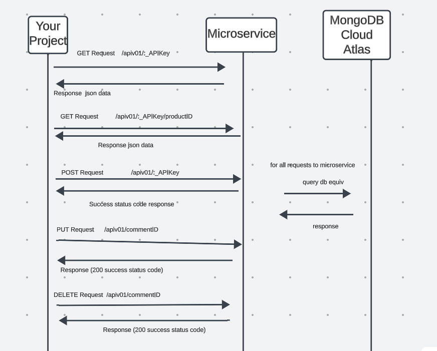

# API
###### assumption: requested MongoDB connection string from me to update .env

###  Steps to run microservice (rating system)

1. npm ci

2. npm install dotenv

3. npm start  

### API endpoints
##### GET requests

* GET /apiv01/reviews/:\_APIKey
     - No body accepted -> Retrieves all reviews for your system (your system is identified by API Key)

* GET /apiv01/reviews/:\_APIKey/:\_productID
     - No body accepted -> retrieves all reviews for desired product for your system (your system is identified by API Key)

#### POST requests

* POST /apiv01/reviews
     - Body(APIKey, productID, title, body) -> Create a review with specified title and text (your system is identified by API Key)

#### PUT requests

* PUT /apiv01/reviews/:\_commentID
     - Body(APIKey, productID, title, body) > update a specific review's info (your system is identified by API Key)

### DELETE requests

* DELETE /apiv01/reviews/:\_commentID
    - No body accepted -> delete a specific comment

# Sequence Diagram
[Sequence Diagram](./diagram.png)

# UI

## assumption: updated proxy on package.json if change api port# from 3000

### steps to run React UI

### 1. npm ci

### 2. npm start
